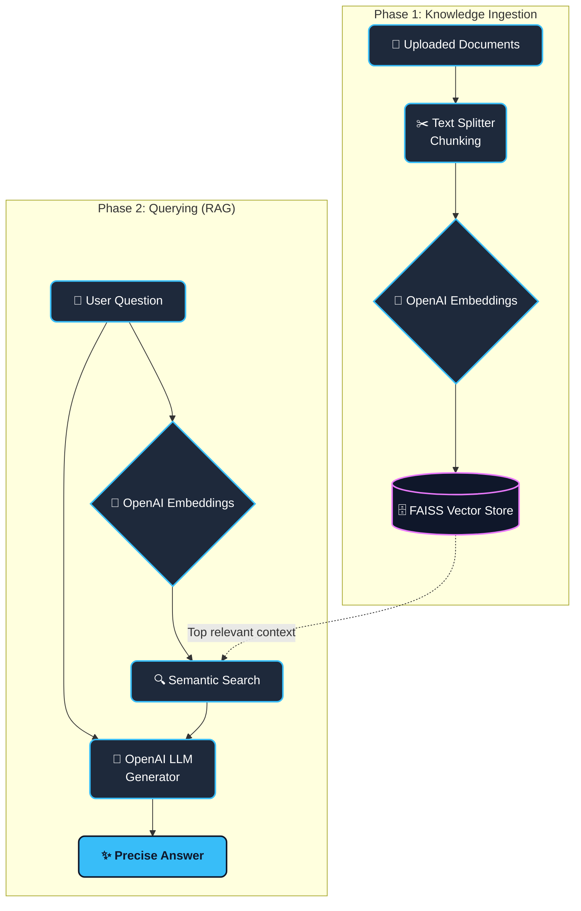

# 🤖 Cynthia's RAG Q&A App

Welcome to **Cynthia's RAG Q&A App**! This project is a beginner-friendly AI chatbot built using **Retrieval-Augmented Generation (RAG)**. It allows you to upload your own documents (PDFs, Word documents, text files) and ask questions about them, powered by OpenAI's language models.

---

## 🏗️ Architecture: How it Works

Ever wondered how AI can "read" your documents and answer questions? Here is the flow:



1. **Document Loading**: You upload files (PDF, DOCX, TXT) via the Streamlit interface. The app extracts text from these files.
2. **Chunking**: Large documents are split into smaller, manageable pieces (chunks) so the AI can process them easily.
3. **Embedding**: We use OpenAI's embeddings to convert these text chunks into numerical vectors (lists of numbers representing the meaning of the text).
4. **Vector Store (FAISS)**: These vectors are stored in a local FAISS index designed for blazing-fast similarity searches.
5. **Retrieval**: When you ask a question, your question is also embedded. The app searches FAISS for the most relevant text chunks.
6. **Generation**: The retrieved context and your question are passed to the OpenAI Large Language Model (LLM), which generates a precise answer based *only* on your documents.

---

## 🛠️ Prerequisites

Before you start, make sure you have:
- **Python 3.8+** installed on your machine.
- An **OpenAI API Key** (Get one from [OpenAI Developer Platform](https://platform.openai.com/)).

---

## 🚀 Setup & Installation

Follow these steps to run the app on your local machine:

### 1. Clone or Download the Project
Ensure you are in the project folder `RAG_Chatbot`.

### 2. Create a Virtual Environment
It's best practice to keep your Python packages isolated.
```bash
python3 -m venv venv
source venv/bin/activate  # On Windows, use: venv\Scripts\activate
```

### 3. Install the Dependencies
Install the required LangChain, Streamlit, and document parsing libraries:
```bash
pip install langchain-openai langchain-community langchain-core pypdf docx2txt faiss-cpu streamlit
```

*(Note: We use `faiss-cpu` for efficient local vector search without requiring a GPU!)*

---

## 🎯 Usage

1. Start the Streamlit server:
   ```bash
   python3 -m streamlit run rag_chatbot.py
   ```
2. Your browser will automatically open to `http://localhost:8501`.
3. Look at the **Setup** sidebar on the left:
   - **Enter your OpenAI API key.**
   - **Upload** one or more PDF, DOCX, or TXT files.
4. Wait for the app to process and index your documents (you'll see success messages in the sidebar).
5. Type your question in the main chat interface—the AI will read your uploaded files and provide an answer!

---

## 🧩 Project Structure

- `rag_chatbot.py` - The core application script containing UI logic and RAG implementation.
- `faiss_index/` - (Auto-generated) A local folder where your document embeddings are saved so they don't have to be re-processed every time.
- `requirements.txt ` - A list of Python libraries needed to run the application.

---

## 💡 Troubleshooting

- **Error: `ModuleNotFoundError`**: You are missing a package. Make sure your virtual environment is activated and you ran the `pip install` command above.
- **Error: `AuthenticationError`**: Your OpenAI API key is missing or invalid. Check that you pasted it correctly into the sidebar.
- **Can't read PDFs?**: If a PDF causes errors, it might be an image-based PDF (scanned) rather than a text-based PDF.
- **How do I reset?**: If the chatbot is giving weird answers from old documents, click **"Reset FAISS Index"** in the sidebar.

Enjoy chatting with your data!
